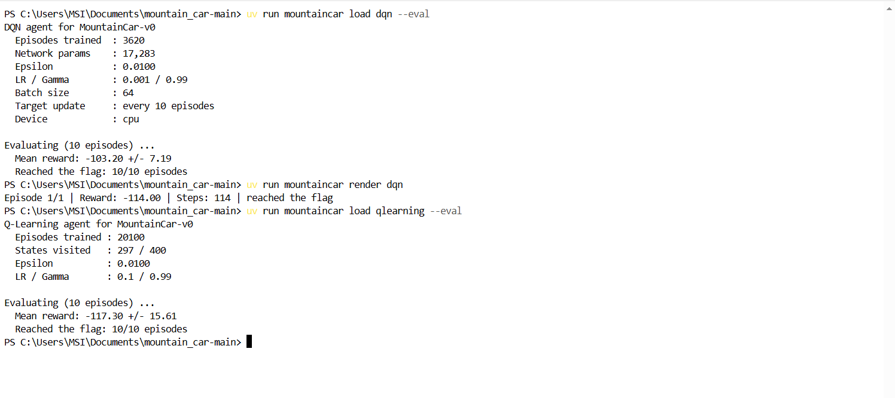

# Actividad de Aprendizaje por Refuerzo: MountainCar-v0

## Descripción de la actividad

En esta actividad se implementan y comparan dos enfoques de Aprendizaje por Refuerzo para resolver el entorno **MountainCar-v0**:

1. **Q-Learning tabular**
2. **Deep Q-Network (DQN)**

El propósito es analizar las diferencias entre un método tabular clásico y un método de Deep Reinforcement Learning basado en redes neuronales.

---

## 1. Entorno MountainCar-v0

MountainCar-v0 representa un automóvil situado entre dos montañas. El vehículo no tiene suficiente potencia para subir directamente la montaña de la derecha, por lo que debe aprender a desplazarse hacia ambos lados para generar impulso hasta alcanzar la bandera.

El estado del entorno está definido por dos variables continuas:

- **Posición** del vehículo.
- **Velocidad** del vehículo.

El agente dispone de tres acciones discretas:

- Acelerar hacia la izquierda.
- No acelerar.
- Acelerar hacia la derecha.

Cada episodio tiene un máximo de **200 pasos**.

---

## 2. Q-Learning tabular

Q-Learning utiliza una tabla Q para almacenar el valor esperado de ejecutar cada acción en cada estado.

Como MountainCar-v0 posee un espacio de estados continuo, fue necesario realizar una **discretización** de las variables posición y velocidad.

El entrenamiento sigue de forma general el siguiente proceso:

1. Obtener el estado actual del vehículo.
2. Discretizar el estado.
3. Seleccionar una acción mediante una estrategia epsilon-greedy.
4. Ejecutar la acción en MountainCar-v0.
5. Obtener la recompensa y el nuevo estado.
6. Actualizar la tabla Q mediante la ecuación de Bellman.
7. Repetir el proceso durante los episodios de entrenamiento.

La actualización utilizada corresponde a:

Q(s,a) = Q(s,a) + α [r + γ max Q(s',a') - Q(s,a)]

donde:

- α es la tasa de aprendizaje.
- γ es el factor de descuento.
- r es la recompensa.
- s' es el nuevo estado.

### Hiperparámetros y resultados de Q-Learning

- Episodios entrenados: **20100**
- Estados visitados: **297 / 400**
- Learning rate (α): **0.1**
- Gamma (γ): **0.99**
- Epsilon final: **0.01**
- Recompensa media de evaluación: **-128.30 ± 21.69**
- Meta alcanzada: **10/10 episodios**

En una ejecución renderizada, el agente alcanzó la bandera en **103 pasos**, obteniendo una recompensa de **-103**.

### Esquema propio del entrenamiento de Q-Learning

> En esta sección se incorporará el esquema elaborado por el estudiante.

---

## 3. Deep Q-Network (DQN)

DQN utiliza una **red neuronal artificial** para aproximar la función de valor-acción Q(s,a), evitando almacenar explícitamente una tabla Q.

La red neuronal recibe como entrada las variables que describen el estado del automóvil:

- Posición.
- Velocidad.

La salida de la red contiene un valor Q para cada una de las tres acciones disponibles.

La implementación utiliza elementos característicos de DQN:

- Red neuronal Q.
- Target Network.
- Experience Replay Buffer.
- Mini-batches.
- Estrategia de exploración.
- Optimizador Adam.

En MountainCar es importante generar secuencias de movimiento que permitan al automóvil acumular impulso. En la implementación se empleó una estrategia de exploración temporalmente correlacionada para mantener determinadas acciones durante varios pasos y favorecer la exploración de estados relevantes.

### Hiperparámetros y resultados de DQN

- Episodios entrenados acumulados: **3620**
- Parámetros de la red: **17283**
- Learning rate: **0.001**
- Gamma: **0.99**
- Batch size: **64**
- Actualización de Target Network: **cada 10 episodios**
- Epsilon final: **0.01**
- Recompensa media de evaluación: **-103.20 ± 7.19**
- Meta alcanzada: **10/10 episodios**

En una ejecución renderizada, el agente alcanzó la bandera en **114 pasos**, obteniendo una recompensa de **-114**.

### Esquema propio del entrenamiento de DQN

> En esta sección se incorporará el esquema elaborado por el estudiante.

---

## 4. Comparación de Q-Learning y DQN

| Característica | Q-Learning | DQN |
|---|---|---|
| Representación de Q | Tabla Q | Red neuronal |
| Estados utilizados | Discretizados | Continuos |
| Learning rate | 0.1 | 0.001 |
| Gamma | 0.99 | 0.99 |
| Epsilon final | 0.01 | 0.01 |
| Recompensa media | -128.30 | -103.20 |
| Meta alcanzada | 10/10 | 10/10 |
| Complejidad de implementación | Menor | Mayor |

Los dos agentes consiguieron alcanzar la bandera en los **10 episodios de evaluación**.

En esta ejecución experimental, DQN obtuvo una recompensa media menos negativa (**-103.20**) que Q-Learning (**-128.30**). Sin embargo, DQN requiere una implementación más compleja, debido al uso de una red neuronal, Replay Buffer, Target Network y optimización mediante descenso de gradiente.

Q-Learning presenta una implementación más sencilla e interpretable, aunque requiere discretizar el espacio continuo de estados.

---

---

## Evidencias de la actividad

A continuación se presentan las evidencias correspondientes al entrenamiento y evaluación de los agentes Q-Learning y Deep Q-Network (DQN) en el entorno MountainCar-v0.

### Evidencia de los resultados obtenidos

La siguiente captura muestra la evaluación final de los dos agentes:

Los resultados de evaluación fueron:

| Método | Recompensa media | Episodios exitosos |
|---|---:|---:|
| Q-Learning | -117.30 ± 15.61 | 10/10 |
| DQN | -103.20 ± 7.19 | 10/10 |

Los dos métodos lograron alcanzar la bandera en los 10 episodios utilizados durante la evaluación.

### Esquemas del proceso de entrenamiento

Los esquemas elaborados para representar gráficamente el proceso de entrenamiento se encuentran en el siguiente documento:

[Ver esquemas del proceso de entrenamiento](evidencias/Esquema_Q_Learning_MountainCar.pdf)

El documento presenta gráficamente las etapas utilizadas para comprender el proceso de aprendizaje de los agentes implementados en esta actividad.

## 6. Archivos principales del proyecto

- `MountainCar_Actividad.ipynb`: notebook de desarrollo y análisis de la actividad.
- `src/mountain_car/agents/qlearning.py`: implementación del agente Q-Learning.
- `src/mountain_car/agents/dqn.py`: implementación del agente DQN.
- `evidencias/`: esquemas propios y capturas de los resultados experimentales.

---

## 7. Conclusiones

La actividad permitió implementar y comparar dos estrategias diferentes de Aprendizaje por Refuerzo para resolver MountainCar-v0.

Q-Learning utiliza una representación tabular y requiere discretizar las variables continuas del entorno. Su implementación es relativamente sencilla y permitió que el agente alcanzara consistentemente la bandera durante la evaluación.

DQN sustituye la tabla Q por una red neuronal capaz de aproximar la función de valor-acción a partir directamente del estado del entorno. Su implementación requiere mecanismos adicionales como Experience Replay y Target Network.

En las evaluaciones realizadas, ambos métodos alcanzaron la meta en 10 de 10 episodios. Los resultados permiten observar las diferencias entre los métodos tabulares y los enfoques de Deep Reinforcement Learning tanto en su arquitectura como en su proceso de entrenamiento.
